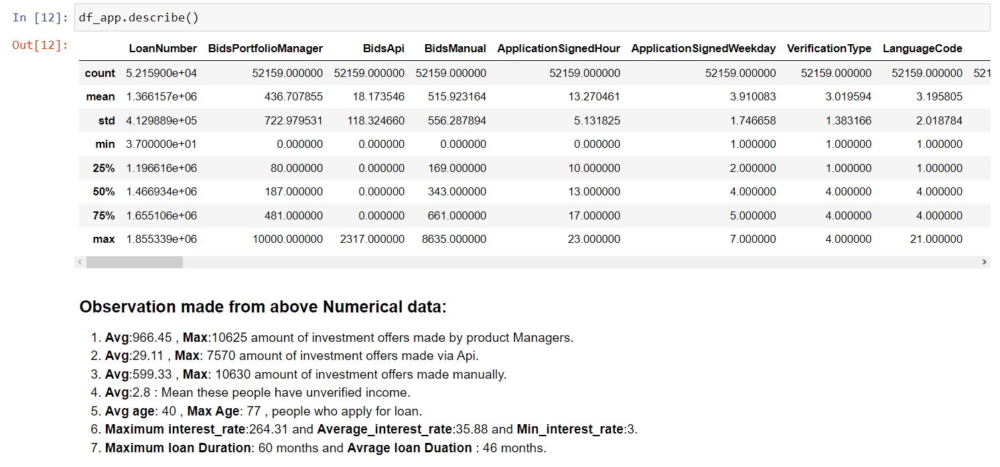
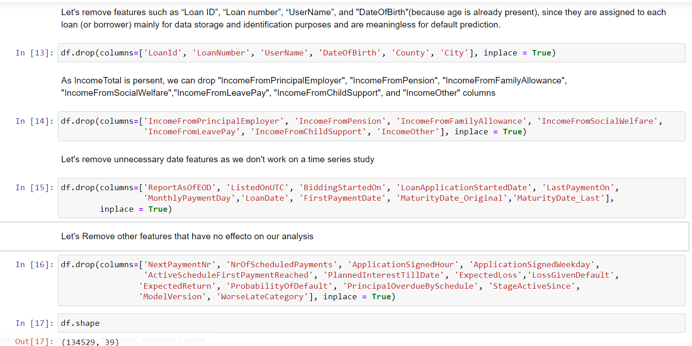
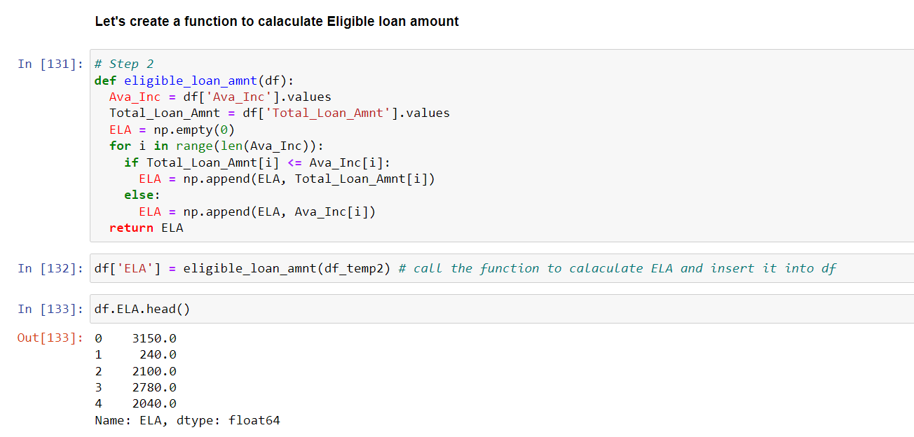
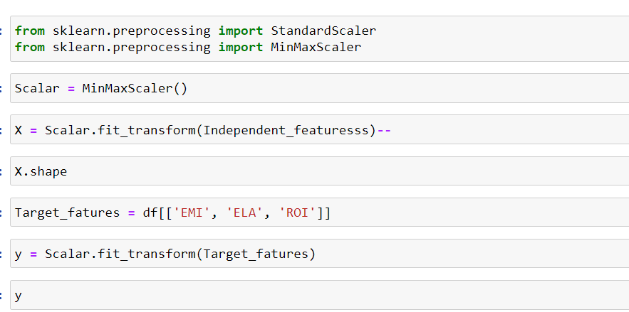

# Introduction
In this project we will be doing credit risk modelling of peer to peer lending Bondora systems. Data for the study has been retrieved from a publicly available data set of a leading European P2P lending platform (Bondora). In addition, they need to make decisions under information asymmetry that works in favor of the borrowers. In order to make rational decisions, lenders want to minimize the risk of default of each lending decision, and realize the return that compensates for the risk
 

__Business Problems we are trying to Solve__

▸	Problems we generally face during buying a Loan like:

•	Here, we are making predictions to whom to grant the loan on the basis of their previous loans and by looking at their previous credit also. 
•	Determining the poor monitoring and control of collateral and fraud people, leaving any losses higher than expected. 
•	We also making conclusion what are the factors affecting the borrower not to repay the loans on time. 

__Main Goal__
This case study aims to identify patterns which indicate if a client has difficulty paying their installments which may be used for taking actions such as denying the loan, reducing the amount of loan, lending (to risky applicants) at a higher interest rate, etc. This will ensure that the consumers capable of repaying the loan are not rejected. In other words, the company wants to understand the driving factors (or driver variables) behind loan defaulters, i.e. the variables which are strong indicators of default. The company can utilise this knowledge for its portfolio and risk assessment and also help Lender to grant the loan on the basic of EMI ,ROI,ELA.

__About Dataset__
	
The retrieved data is a pool of both defaulted and non-defaulted loans from the time period between 1st March 2009 and 27th January 2020. The data comprises of demographic and financial information of borrowers, and loan transactions. In P2P lending, loans are typically uncollateralized and lenders seek higher returns as a compensation for the financial risk they take. Such a dataset is very useful for the Banking firms on which different analysis can be done to get insights whether to grant loan or not by looking at their   state/country. 

This is what the dataset looks like :  

 

It has lots of rows and columns, which is 134529 rows spread across 112 columns. Here is the list of columns this dataset has :  

 

# Data Cleaning & Pre-processing
Data Cleaning is an important phase in any data science project, if our data is clean then only we can provide it to our machine learning model. Uncleaned Data can further lead our model with low accuracy. And, If data is incorrect, outcomes and algorithms are unreliable, even though they may look correct. There is no one absolute way to prescribe the exact steps in the data cleaning process because the processes will vary from dataset to dataset. 
The approach used for identifying and treating missing values & outlier treatment. 

 

__Changing Datatypes__ 

 

__Descriptive Analysis of data__ 

 
To find any missing values in our data set we have used Pandas pre built function __isnull()__ to detect any missing values in our datasets. As we can see that column ReScheluledon has a high number of missing values. So our next step is how to handle a large number of missing values. One approach is, that we will delete the column if we don't need that column for further analysis. And, what if we need that column for further analysis then we have use an approach will is a predefined function in Pandas called fillna().

The Whole missing percent of data in our data is: 

 

 
Removing all the features which have more than 40% missing values: 
# Number of these columns  

len(df.columns[(df.isnull().mean()*100) >= 40]) 
# Now we can remove columns having more than 40% missing values
df.drop(columns= DropColList, axis= 1, inplace=True)
 

 

__Creating Target variable :__

Here, status is the variable which help us in creating target variable. The reason for not making status as target variable is that it has three unique values current, Late and repaid. There is no default feature but there is a feature default date which tells us when the borrower has defaulted means on which date the borrower defaulted. So, we will be combining Status and Default date features for creating target variable.The reason we cannot simply treat Late as default because it also has some records in which actual status is Late but the user has never defaulted i.e., default date is null. So we will first filter out all the current status records because they are not matured yet they are current loans.
Now, we will create new target variable in which 0 will be assigned when default date is null means borrower has never defaulted while 1 in case default date is present. 

 
After making Target variable. Checking data types of all columns: 

 
As we can see in numeric column distribution there are many columns which are present as numeric but they are actually categorical as per data description such as Verification Type, Language Code, Gender, Use of Loan, Education, Marital Status,EmployementStatus, OccupationArea etc.
So we will convert these features to categorical feature (Refer to Notebook).

__Outlier Treatment :__

While performing Preprocessing and Data cleaning we have to also deal with outliers. Dealing with outliers is also a necessary step to be taken for further analysis and model building. Outliers are data points in a data set that is distant from all other observations. A data point that lies outside the overall distribution of the dataset
 

 

 
Variable transformation is a way to make the data work better in your model. Here specifically we have Replaced the unwanted symbol and nan value with NumPy nan values i.e np. nan which we are going to deal in missing value. And we have also converted the data types of few columns which will help build our model. The need for this is because we need our model to have a good score and accuracy which will make good predictions. So to feed the data to our model we must ensure to take these steps and make our data insightful.

# EDA & Business Implication	

EDA stands for exploratory data analysis where we explore our data and grab insights from it. EDA helps us in getting knowledge in form of various plots and diagrams where we can easily understand the data and its features.

__Categorical Analysis__
 

 

__Univariate Analysis of each column__  
 
 
 
 
 
 

__Numerical Analysis__
 

 

__Univariate Analysis of each column__  
 
 
 

# Feature Encoding & Feature Selection & Feature Scaling & Modeling Building

__Feature Encoding:__

Machine learning models can only work with numerical values. For this reason, it is necessary to transform the categorical values of the relevant features into numerical ones. This process is called feature encoding.

__Feature Selection:__

Feature Selection is the method of reducing the input variable to your model by using only relevant data and getting rid of noise in data. It is the process of automatically choosing relevant features for your machine learning model based on the type of problem you are trying to solve.
There are many types and techniques for feature selection such as:
1.	Filter
•	Correlation.
•	Variance threshold.
•	Chi-squared.
•	Anova.
•	Information gain.
2.	Wrapper
•	Recursive Feature Elimination (RFE).
3.	Embedded
•	L1 and L2 Regularization Methods.
Now we will use correlation filter selection technique:
•	Highly correlated features will be considered duplicated features while using the machine learning model, so we should drop them(drop one and leave the another).

__Feature Extraction and Dimensionality-reduction using (PCA)__

Principal component analysis, or PCA, is a dimensionality-reduction method that is often used to reduce the dimensionality of large data sets, by transforming a large set of variables into a smaller one that still contains most of the information.
The idea of PCA is simple — reduce the number of variables of a data set, while preserving as much information as possible.
PCA steps:
•	Feature Scaling.
•	Covariance Matrix computation.
•	Compute the eigenvectors and eigenvalues of the covariance matrix to identify the principal components.
•	Feature Vector.
•	Recast the Data Along the Principal Components Axes.

1. __Classification Model Building :__

* Feature Encoding: 
 

* Feature Selection:  
 

* Feature Scaling:  
 

* PCA :  
 
 

* __Model Selection and Why?__
After cleaning and processing the data then comes the modeling part which includes building Machine Learning models, let’s first understand in brief what Machine Learning is?

Machine Learning is a technique that analyzes past data and tries to extract meaningful insights and patterns from them which can be further used to perform predictions in future. For example, classifying whether a tumor is benign or malignant, predicting stock prices, etc. One such application which we’re using right here is predicting house prices. Before making predictions first we need to build a model and train it using past data. 

First, we need to separate the dataset into two parts: features (property attributes) and labels (prices) which is the required format for any model to be trained on.

Then the data needs to be split into 2 sets 
1.	Training set - This will be the part of the dataset which the model will be using to train itself, the size should be at least 60-70% of the total data we’ve.
2.	Testing set - To evaluate how the model is performing on the unseen data on which the model will be doing future predictions on, test set is used. It helps to understand how much error is there between actual and predicted values. 
 

We implement two models on Classification and thier names are logistics Regression and Random Forest Classification models and their result are as follow:  
 
 

__Building Models Conclusion:__
By using the two models with the same features, we discovered that the Random Forest Classifier model gives accuracy better than the Logistic Regression model. 

2. __Regression Model Building :__

Before begining on feature Encoding part , we have create three new variables for target variables.  
 
 
 
 
 
 

For Feature Encoding : we select these features : 
<table>
  <tr>
    <td>AppliedAmount</td>
    <td>Amount</td>
    <td>Interest</td>
    <td>MonthlyPayment</td>
  </tr>
  <tr>
    <td>IncomeTotal</td>
    <td>Country</td>
    <td>CreditScoreEsMicroL</td>
    <td>InterestAndPenaltyBalance</td>
  </tr>
  <tr>
    <td>PrincipalBalance</td>
    <td>DebtToIncome</td>
    <td>ExistingLiabilities</td>
    <td>Rating</td>
  </tr>
   <tr>
    <td>LanguageCode</td>
    <td>PrincipalBalance</td>
  </tr>

</table>
 

* Feature Encoding: 
 

* Feature Scaling:  
 

* PCA :  
 
 

* __Model Selection and Why?__
After cleaning and processing the data then comes the modeling part which includes building Machine Learning models, let’s first understand in brief what Machine Learning is?

Machine Learning is a technique that analyzes past data and tries to extract meaningful insights and patterns from them which can be further used to perform predictions in future. For example, classifying whether a tumor is benign or malignant, predicting stock prices, etc. One such application which we’re using right here is predicting house prices. Before making predictions first we need to build a model and train it using past data. 

First, we need to separate the dataset into two parts: features (property attributes) and labels (prices) which is the required format for any model to be trained on.

Then the data needs to be split into 2 sets 
1.	Training set - This will be the part of the dataset which the model will be using to train itself, the size should be at least 60-70% of the total data we’ve.
2.	Testing set - To evaluate how the model is performing on the unseen data on which the model will be doing future predictions on, test set is used. It helps to understand how much error is there between actual and predicted values. 
 

We implement two models on Regression problem and thier names are Linear Regression and Ridge Regression models and their result are as follow:  
 
 

__Building Models Conclusion:__
By comparing the three models using the same features, we discovered that the two models give almost the same accuracy .

# Pipelinning & Deployment

ML pipeline is a means of automating the machine learning workflow by enabling data to be transformed and correlated into a model that can then be analyzed to achieve outputs. This type of ML pipeline makes the process of inputting data into the ML model fully automated.

For piplining of both Classification and Regression model . I build __Bondora_Updated.csv__ file in which I include 34 features : 30 input features and 4 output that which model is going to predict

The name of input_ variables are :  

<table>
  <tr>
    <td>Bids portfolio Manager</td>
    <td>Bids Api</td>
    <td>Bids Manual</td>
    <td>New Credit Customer</td>
    <td>Age</td>
    <td>Applied Amount</td>
    <td>Interest</td>
    <td>Monthly Payment</td>
    <td>Income Total</td>
    <td>Existing Liabilities</td>
   </tr>
  <tr>
    <td>Refinance Liabilities</td>
    <td>Debt To Income</td>
    <td>Free Cash</td>
    <td> Restructured </td>
    <td>Principle Payment Made</td>
    <td>Interest And Penalty Payments Made</td>
    <td>Previous Early Repayments Before Loan</td>
    <td>Verification Type</td>
    <td>Language Code</td>
    <td>Gender</td>
  </tr>
  <tr>
   <td>Country</td>
    <td>Use Of Loan</td>
    <td>Education</td>
    <td>Martial Status</td>
    <td>Employement Status</td>
    <td>Employment Duration Current Employere</td>
    <td>Occupation Area</td>
    <td>Homeownership Type</td>
    <td>Rating</td>
    <td>Credit Score Es MicroL</td>
  </tr>

</table>
 

The name of __Output variables__ are :
1. Loan Status.
2. EMI.
3. ROI.
4. ELA.

To see the Piplining work ( Refer to notebook). The Final prediction for classification model is __87.72%__ and for Regression problem our final prediction is 
__0.87%__  .

The User interface of deployment app is :  

 
 
You can see my notebook. All  the work is explained in detail.

### AUTHOR

<strong>Shehryar Gondal</strong>

You can get in touch with me on my LinkedIn Profile: 
 

You can also follow my GitHub Profile to stay updated about my latest projects: 

If you liked the repo then kindly support it by giving it a star ⭐.

